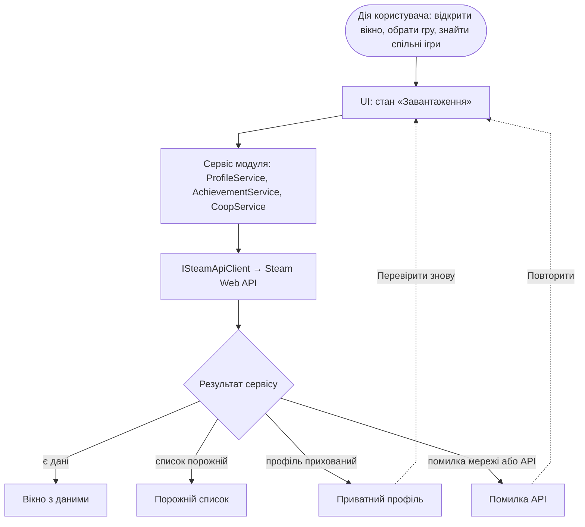

# UI Flow — взаємодія інтерфейсу з бізнес-логікою

Документ описує, як вікна SteamTracker реагують на результати бізнес-логіки: у яких станах буває вікно і як користувач переходить між вікнами.

Що описано окремо:

- сценарії користувача — [Use Case Diagram](use-case-diagram.md);
- детальні послідовності викликів (завантаження профілю, Achievement Planner) — [Sequence Diagrams](sequence-diagrams.md);
- макети — Figma, файл «Steam Tracker — MVP UI» (фрейми `02 · Головна`, `03 · Досягнення`, `06 · Co-op Matchmaker`, `10 · Стани вікон`, `11 · Карта переходів`).

У завданні вікна названо «Dashboard» і «Achievement Roadmap». У макетах це «Головна» і «Досягнення», у діаграмах — Achievement Planner.

## 1. Потік взаємодії UI з бізнес-логікою

UI не звертається до Steam Web API напряму. Будь-яка дія користувача переводить вікно в стан «Завантаження». Далі сервіс модуля отримує дані через `ISteamApiClient` і повертає явний результат, а UI показує відповідний стан вікна.

Під час завантаження UI не блокується: запити асинхронні, а бічне меню лишається доступним (US-24). Помилки мережі не доходять до UI як винятки. Сервіс повертає результат зі статусом, тож застосунок не завершується аварійно (US-25).

## 2. Стани вікон

| Вікно | Порожній список | Помилка API | Приватний профіль |
|---|---|---|---|
| Головна | У бібліотеці немає ігор | Не вдалося отримати дані профілю | Профіль приватний, з поясненням, що змінити в Steam |
| Досягнення | Усі досягнення закрито або в гри їх немає | Не вдалося завантажити досягнення | Подробиці ігор приховані, прогрес недоступний |
| Co-op Matchmaker | Спільних ігор не знайдено | Не всі бібліотеки отримано, результат не показується | Бібліотеку учасника приховано, результат показується без нього з попередженням |

Як розрізняються стани:

- **Приватний профіль** — окремий стан, а не помилка чи нуль. `GetPlayerSummaries` повертає рівень видимості профілю, а `GetOwnedGames` і `GetPlayerAchievements` для закритих подробиць ігор повертають порожню відповідь.
- **Порожній список** — запит успішний і профіль відкритий, але даних немає. Користувач виходить із цього стану, змінивши параметри: обравши іншу гру або інший склад учасників.
- **Помилка API** — немає мережі, таймаут, відповіді 5xx або 429. У вікні є кнопка «Повторити».
- **Некоректний SteamID** у Co-op Matchmaker перевіряється до запиту: помилка показується біля поля вводу, а запит не надсилається (US-20).

## 3. Переходи між вікнами

| Звідки | Дія | Куди |
|---|---|---|
| Запуск | SteamID не збережено | 01 · Вхід через Steam |
| Запуск | SteamID збережено (US-02) | 02 · Головна |
| 01 · Вхід | вхід через Steam OpenID підтверджено | 02 · Головна |
| 02 · Головна | пункт бічного меню або картка модуля | потрібний модуль (03–07) |
| Будь-який модуль | пункт бічного меню | інший модуль або Головна, без перезапуску (US-23) |
| Будь-яке вікно | «Вийти»: збережений SteamID видаляється (US-03) | 01 · Вхід через Steam |
