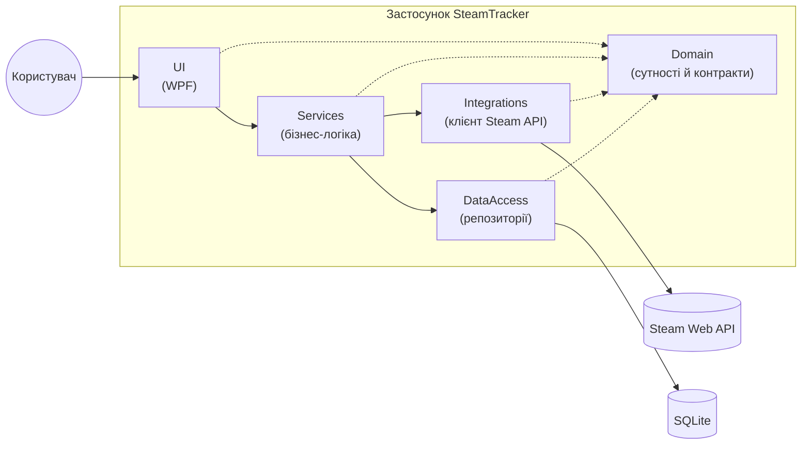

# Архітектура Steam Tracker

## Зміст

1. [Архітектурний підхід](#1-архітектурний-підхід)
2. [Структура рішення](#2-структура-рішення)
3. [Компоненти та їхня відповідальність](#3-компоненти-та-їхня-відповідальність)
4. [Схема взаємодії компонентів](#4-схема-взаємодії-компонентів)
5. [Модель даних](#5-модель-даних)
6. [Ключові рішення та обґрунтування](#6-ключові-рішення-та-обґрунтування)

---

## 1. Архітектурний підхід

Steam Tracker — **локальний настільний застосунок для Windows** на WPF. Окремого сервера немає: застосунок сам звертається до Steam Web API і зберігає дані в локальній базі SQLite.

Обрано **шарову (layered) архітектуру** за принципами Clean/Onion:

- застосунок розбито на шари, кожен має одну зону відповідальності;
- залежності спрямовані **до `Domain`** — він нічого не знає про інші шари;
- **UI не звертається до Steam API чи бази даних напряму**: будь-яка дія користувача йде через шар `Services`, який вирішує, звідки взяти дані (з локального кешу чи зі Steam API);
- шари спілкуються через інтерфейси (контракти), оголошені в `Domain`, тому реалізацію можна замінити без змін у решті коду (наприклад, підмінити клієнт Steam API в тестах).

**Навіщо так:** логіка роботи з API та даними відокремлена від коду інтерфейсу — це пряма нефункціональна вимога «Тестованість» зі специфікації.

---

## 2. Структура рішення

Рішення `SteamTracker.sln` складається з шести проєктів:

```text
SteamTracker/
├── SteamTracker.Domain/          # сутності та контракти
├── SteamTracker.Services/        # бізнес-логіка
├── SteamTracker.Integrations/    # Steam Web API
├── SteamTracker.DataAccess/      # SQLite (ADO.NET)
├── SteamTracker.UI/              # WPF-інтерфейс
└── SteamTracker.Tests/           # автоматизовані тести
```

**Правила залежностей між проєктами:**

| Проєкт         | Посилається на                                     |
| -------------- | -------------------------------------------------- |
| `Domain`       | нічого                                             |
| `Services`     | `Domain`                                           |
| `Integrations` | `Domain`                                           |
| `DataAccess`   | `Domain`                                           |
| `UI`           | `Domain`, `Services`, `Integrations`, `DataAccess` |
| `Tests`        | `Domain`, `Services`                               |

`Services` не посилається на `Integrations` і `DataAccess` напряму: він працює з ними через інтерфейси з `Domain`. Конкретні реалізації підключає `UI` під час запуску застосунку, тому має посилання на всі проєкти.

---

## 3. Компоненти та їхня відповідальність

### `SteamTracker.Domain` — ядро

**Відповідає за:** опис предметної області та контракти між шарами.

- сутності: гравець, гра, гра у бібліотеці гравця, досягнення, прогрес гравця по досягненнях, дружба;
- інтерфейси, через які шари взаємодіють між собою (зокрема інтерфейс клієнта Steam API).

**Не робить:** жодної логіки, запитів чи роботи з файлами. Не залежить від інших проєктів.

### `SteamTracker.Integrations` — зв'язок зі Steam

**Відповідає за:** всю взаємодію зі Steam Web API.

- відправляє HTTP-запити (`HttpClient`);
- розбирає JSON-відповіді й перетворює їх у сутності `Domain`;
- обробляє мережеві помилки (немає інтернету, Steam недоступний) і повертає явний результат, а не кидає виняток у UI.

**Не робить:** не зберігає дані, не вирішує, коли робити запит, не знає про інтерфейс.

### `SteamTracker.DataAccess` — локальне сховище

**Відповідає за:** збереження й читання даних у SQLite.

- створює схему бази при першому запуску;
- виконує параметризовані SQL-запити через ADO.NET;
- зберігає кеш відповідей Steam із міткою часу отримання.

**Не робить:** не вирішує, чи кеш застарілий, і не звертається до Steam.

### `SteamTracker.Services` — бізнес-логіка

**Відповідає за:** сценарії застосунку. Це «мозок», який координує решту.

- вирішує, звідки брати дані: з кешу, якщо він актуальний (TTL), або зі Steam API;
- формує результат для UI: наприклад, roadmap досягнень (недосягнуті досягнення, відсортовані за глобальним % виконання), підбір спільних ігор у co-op (після MVP);
- розрізняє штатні ситуації (приватний профіль) і помилки.

**Не робить:** не рисує інтерфейс, не пише SQL, не будує HTTP-запити.

### `SteamTracker.UI` — інтерфейс

**Відповідає за:** показ даних і взаємодію з користувачем (WPF/XAML).

- показує головне вікно та екрани модулів;
- відображає стани: завантаження, дані недоступні (приватний профіль), помилка;
- передає дії користувача до `Services`.

**Не робить:** не містить бізнес-логіки, не звертається до API та бази даних.

### `SteamTracker.Tests` — перевірка якості

**Відповідає за:** автоматизовані тести логіки (передусім `Services`) без реальної мережі та бази — із підміною залежностей.

---

## 4. Схема взаємодії компонентів



_Суцільні стрілки — виклики; пунктирні — залежність від сутностей і контрактів `Domain`._

**Типовий потік (на прикладі відкриття профілю):**

1. Користувач відкриває профіль → `UI` показує стан «Завантаження» й звертається до `Services`.
2. `Services` просить `DataAccess` віддати кешований профіль.
3. Якщо кеш є й не застарів — повертає його в `UI`.
4. Якщо кешу немає або він застарів — `Services` викликає `Integrations`, ті звертаються до Steam Web API.
5. Якщо профіль приватний — `UI` показує стан «дані недоступні»; якщо публічний — `Services` зберігає його через `DataAccess` і повертає в `UI`.

Повна послідовність викликів — у [sequence-diagrams.md](diagrams/sequence-diagrams.md).

---

## 5. Модель даних

Локальна база SQLite виконує роль **кешу даних Steam Web API** (не є джерелом правди): кожен рядок має мітку часу отримання (`FetchedAt` / `LastFetchedAt`), за якою визначається, чи кеш застарів.

Основні сутності: `Player`, `Game`, `OwnedGame`, `Achievement`, `PlayerAchievement`, `Friendship`.

- ER-діаграма та ключові рішення — [db-model.md](db-model.md)
- SQL-схема — [schema.sql](schema.sql)

---

## 6. Ключові рішення та обґрунтування

### 6.1 Шарова архітектура

|               |                                                                                                                           |
| ------------- | ------------------------------------------------------------------------------------------------------------------------- |
| **Що обрали** | Розбиття на шари `Domain` / `Services` / `Integrations` / `DataAccess` / `UI`                                             |
| **Чому**      | Кожен шар має чітку відповідальність; логіка API та даних відокремлена від UI, її можна тестувати без інтерфейсу й мережі |

### 6.2 WPF замість Windows Forms

|               |                   |
| ------------- | ----------------- |
| **Що обрали** | WPF (XAML)        |
| **Чому**      | Див. список нижче |

- **Розділення розмітки та логіки.** Розмітка пишеться в XAML, логіка — в окремому коді. У WinForms розмітка генерується в `Designer.cs`, і код легко змішується з інтерфейсом.
- **Прив'язка даних (data binding).** Списки ігор і досягнень та стани вікна (завантаження, приватний профіль, помилка) оновлюються автоматично, без ручного копіювання даних у контроли.
- **Підтримка MVVM.** Логіку подання можна тестувати без UI.
- **Шаблони (`DataTemplate`) і стилі.** Один раз описуємо, як показати гру чи досягнення (іконка, назва, % виконання), і застосовуємо до всього списку.
- **Гнучке компонування** (`Grid`, `StackPanel`). Інтерфейс адаптується до розміру вікна, тоді як у WinForms елементи позиціонуються за координатами.
- **Векторна графіка та масштабування DPI.** Інтерфейс чіткий на екранах із різним масштабом.
- **Вбудовані анімації та візуалізація.** Прогрес-бари й графіки без сторонніх бібліотек.
- **Сумісність з `async/await`.** Результат HTTP-запиту потрапляє в UI через прив'язку, інтерфейс не блокується.

**Недоліки:** складніша крива навчання (XAML, binding, MVVM) і лише Windows — для нас це прийнятно, бо цільова платформа — Windows.

### 6.3 SQLite

|               |                                                                                                                                                        |
| ------------- | ------------------------------------------------------------------------------------------------------------------------------------------------------ |
| **Що обрали** | Локальна база SQLite                                                                                                                                   |
| **Чому**      | Застосунок локальний і однокористувацький, тому окремий сервер БД не потрібен. База — один файл поруч із застосунком, без встановлення та налаштування |

### 6.4 ADO.NET

|               |                                                                                                                                             |
| ------------- | ------------------------------------------------------------------------------------------------------------------------------------------- |
| **Що обрали** | ADO.NET (Microsoft.Data.Sqlite)                                                                                                             |
| **Чому**      | Погоджена технологія роботи з даними на платформі .NET; повний контроль над SQL-запитами, які параметризуються для захисту від SQL-ін'єкцій |

### 6.5 Кеш у SQLite з TTL

|               |                                                                                                                           |
| ------------- | ------------------------------------------------------------------------------------------------------------------------- |
| **Що обрали** | Зберігання відповідей Steam API в локальній БД із терміном актуальності (TTL)                                             |
| **Чому**      | Зменшує кількість викликів Steam API (ліміт ~100 000 запитів на добу на ключ); дані зберігаються між запусками застосунку |

### 6.6 `HttpClient` та асинхронні виклики

|               |                                                                              |
| ------------- | ---------------------------------------------------------------------------- |
| **Що обрали** | `HttpClient` із `async/await`                                                |
| **Чому**      | Нефункціональна вимога: мережеві виклики асинхронні, інтерфейс не блокується |

### 6.7 Інтерфейси в `Domain`

|               |                                                                                    |
| ------------- | ---------------------------------------------------------------------------------- |
| **Що обрали** | Контракти між шарами (зокрема клієнт Steam API) оголошені як інтерфейси в `Domain` |
| **Чому**      | `Services` не залежить від конкретних реалізацій; у тестах їх можна підмінити      |

### 6.8 Приватний профіль — окремий стан, а не помилка

|               |                                                                                                                                                                  |
| ------------- | ---------------------------------------------------------------------------------------------------------------------------------------------------------------- |
| **Що обрали** | Приватність профілю обробляється як штатний стан, який UI показує окремо                                                                                         |
| **Чому**      | Steam повертає порожні дані, якщо профіль або подробиці ігор закриті. Це не помилка і не «нуль досягнень», тому користувачеві показується зрозуміле повідомлення |

### 6.9 Ключ Steam API поза репозиторієм

|               |                                                                                                          |
| ------------- | -------------------------------------------------------------------------------------------------------- |
| **Що обрали** | Ключ не комітиться в git: user secrets на розробці, конфігураційний файл поза контролем версій на збірці |
| **Чому**      | Безпека: секретні дані не повинні потрапляти у відкритий код                                             |
