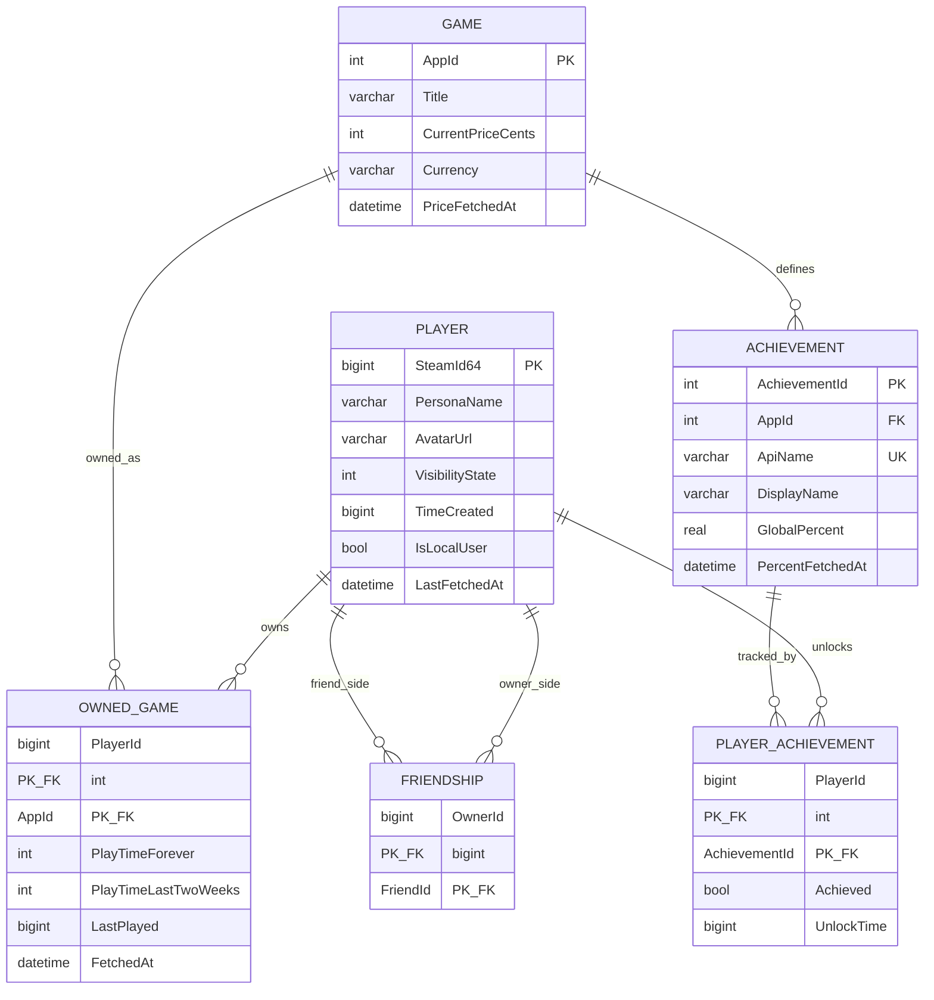

# Модель даних — ER-діаграма

Локальний кеш даних Steam Web API (SQLite, ADO.NET). БД не є джерелом правди —
кожен рядок має поле `FetchedAt`/`LastFetchedAt` для TTL-інвалідації кешу
(див. `Services` — методи спершу читають з БД, і лише при простроченому TTL
чи відсутності рядка йдуть у Steam API, після чого upsert-ять результат назад).

## Ключові рішення

- **`Player`/`Game`/`OwnedGame`/`Friendship`** — натуральні ключі
  (`SteamId64`, `AppId`), без сурогатів.
- Поля, які Steam API повертає не завжди (`PlayTimeLastTwoWeeks`,
  `TimeCreated` для приватних профілів, `CurrentPriceCents` з `appdetails`) —
  навмисно nullable.
- `CHECK (VisibilityState IN (1,3))` та `CHECK (FriendId != OwnerId)` —
  додаються прямо в `CREATE TABLE` (див. `docs/schema.sql`).