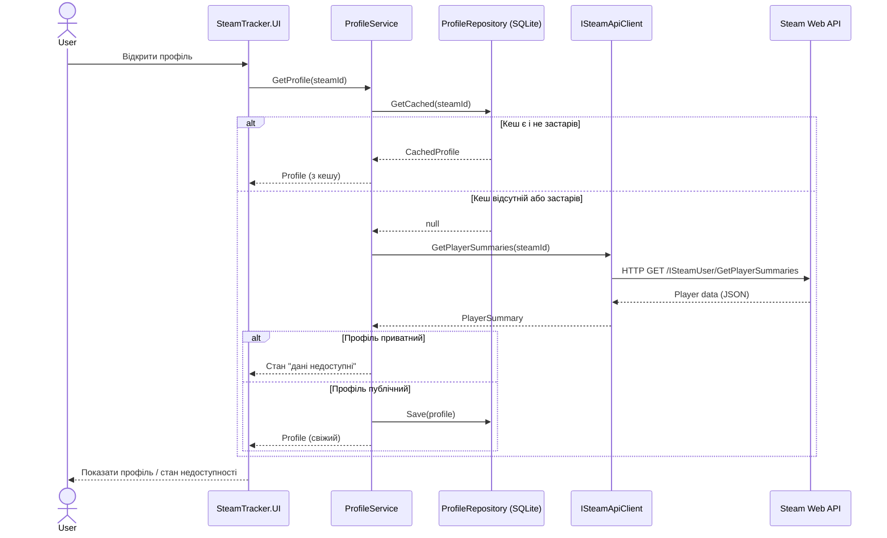

# Sequence Diagram — завантаження та кешування профілю гравця

Флоу показує, як застосунок вирішує: віддати профіль з локального
кешу (SQLite) чи звернутись до Steam API, якщо кеш відсутній або застарів.

## Примітки

- Кеш вважається застарілим за TTL, визначеним у `ProfileService` (наприклад, 15 хв).
- Приватний профіль обробляється як окремий UI-стан, не як помилка.
- Помилки мережі (Steam API недоступний) обробляються через try/catch у `SteamApiClient` з поверненням явного результату (не exception назовні UI).