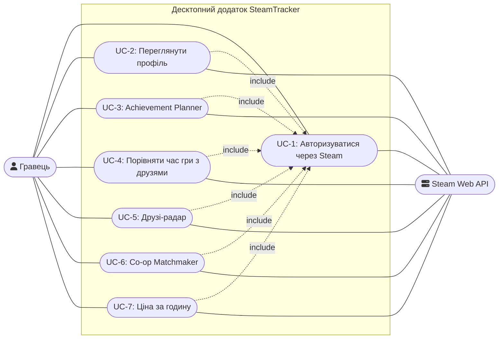

# Use Case Diagram — основні сценарії користувача

Діаграма показує ключові сценарії взаємодії гравця із SteamTracker.
Усі сценарії передбачають попередню авторизацію (UC-1) та взаємодію
із зовнішньою системою Steam Web API.

## Опис сценаріїв

| Use Case | Опис |
|---|---|
| UC-1: Авторизуватися через Steam | Steam OpenID через системний браузер + локальний HttpListener, збереження SteamID64 локально |
| UC-2: Переглянути профіль | Нік, аватар, статус приватності через `GetPlayerSummaries` |
| UC-3: Achievement Planner | Roadmap до 100% ачівок із сортуванням за глобальним % виконання |
| UC-4: Порівняти час гри з друзями | Рейтинг playtime серед друзів по обраній грі |
| UC-5: Друзі-радар | Список друзів онлайн/у грі зараз |
| UC-6: Co-op Matchmaker | Перетин бібліотек кількох гравців |
| UC-7: Ціна за годину | Розрахунок $/год на основі playtime і поточної ціни в Steam Store |

## Примітки

- Усі сценарії (UC-2 – UC-7) включають UC-1 як обов'язкову передумову — без авторизації жоден інший сценарій недоступний.
- Steam Web API — зовнішня система (non-human actor), з якою взаємодіє кожен сценарій для отримання даних.